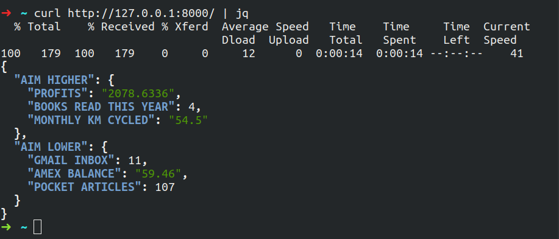

# Kaizen Server - A Personal Dashboard

In a world where we are always striving to do better, and to *continously improve*, this server provides you with current metrics. 

To run in a Python 3 Virtual Env:

    $ pip install -r requirements.txt; ./manage.py runserver;
    $ curl http://127.0.0.1:8000/ | jq

Natrually, this app continues to improve.

